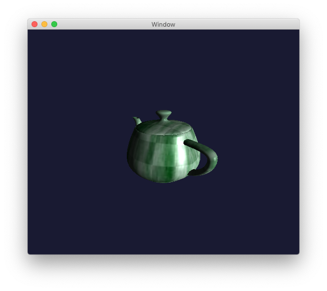

# Example 8

The Example 8 branch of the Metal project shows the use of a shadow map. This is an example of a more complex rendering effect in that we need to render the scene twice: first from the point of view of the light source, and second from the camera point of view.

When compiled and run you should see a rotating green textured teapot with shadows:

# The Full Paper

This example is the first of several examples documented in my PDF available at the [Chaos In Motion Blog](https://chaosinmotion.blog/papers/); look for "Learning the Metal API" for the latest.

# Metal

I'm in the process of trying to learn the [Metal API](https://developer.apple.com/metal/) for the Macintosh. These are the example applications I'm constructing in order to illustrate parts of Metal in a step-by-step organized way.

Metal, for those who don't know, is a low-level API for performing GPU operations, such as real-time graphics or compute-bound tasks. Because Metal is a low-level API, it is very powerful and very fast--and very *very* complicated.

And while there are a few "introduction to Metal" documents and web sites out there, quite a few of them seem to fall short when going beyond the very basic steps of presenting a triangle or perhaps a teapot. Which is cool if you want to just do basic stuff. But can be a pain if you want to do something more complicated.

Thus these examples, and hopefully a PDF-based book which links to these examples (and to web sites discussing the different parts of Metal).

Because as they say, the best way to learn something is to try to teach it to someone else.

# License

Copyright &copy; 2018 William Edward Woody, all rights reserved.

Redistribution and use in source and binary forms, with or without
modification, are permitted provided that the following conditions are met:

1. Redistributions of source code must retain the above copyright notice, this list of conditions and the following disclaimer.

2. Redistributions in binary form must reproduce the above copyright notice, this list of conditions and the following disclaimer in the documentation and/or other materials provided with the distribution.

THIS SOFTWARE IS PROVIDED BY THE COPYRIGHT HOLDERS AND CONTRIBUTORS "AS IS" AND ANY EXPRESS OR IMPLIED WARRANTIES, INCLUDING, BUT NOT LIMITED TO, THE IMPLIED WARRANTIES OF MERCHANTABILITY AND FITNESS FOR A PARTICULAR PURPOSE ARE DISCLAIMED. IN NO EVENT SHALL THE COPYRIGHT OWNER OR CONTRIBUTORS BE LIABLE FOR ANY DIRECT, INDIRECT, INCIDENTAL, SPECIAL, EXEMPLARY, OR CONSEQUENTIAL DAMAGES (INCLUDING, BUT NOT LIMITED TO, PROCUREMENT OF SUBSTITUTE GOODS OR SERVICES; LOSS OF USE, DATA, OR PROFITS; OR BUSINESS INTERRUPTION) HOWEVER CAUSED AND ON ANY THEORY OF LIABILITY, WHETHER IN CONTRACT, STRICT LIABILITY, OR TORT (INCLUDING NEGLIGENCE OR OTHERWISE) ARISING IN ANY WAY OUT OF THE USE OF THIS SOFTWARE, EVEN IF ADVISED OF THE POSSIBILITY OF SUCH DAMAGE.
